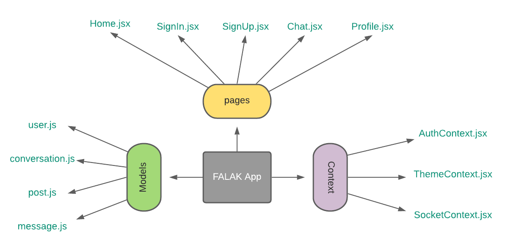

# Falak 

Falak is a platform where programmers can share their thoughts 💡, bugs 🐛 and lack of sleep 😪

## Group Members 
+ [Ali Sartawi](https://github.com/AliBakerSartawi)
+ [Ahmed Abuyahya](https://github.com/AhmadAbuyahya) 
+ [Qais Ata](https://github.com/qaisw96) 

## UML diagram

## DB Schemas 
1. Conversation 

2. Message 

3. Post 

4. User 

## Features & Routes

1. Backend 

### Authentication
Method | Endpoint | Description 
-------| ---------|-------------
post | api/auth/register | to make an account in the app 
post  | api/auth/login | to sign in into the app 

### Users
Method | Endpoint | Description 
-------| ---------|-------------
get  | api/users | to get the user 
get | api/users/friends/:userId | get friends 
put | api/users/:id | to update the user  
put | api/users/:id/follow | follow a user 
put | api/users/:id/unfollow | Un follow a user 
delete  | api/users/:id | to delete the user 

### Posts
Method | Endpoint | Description 
-------| ---------|-------------
 get | api/posts/:id | get a post 
 get | api/posts/timeline/:userId  | get timeline posts 
 get | api/users/profile/:username | get user's all posts (profile page)
 post | api/posts/ | create a post 
 put | api/posts/:id | update a post 
 put | api/posts/:id/like | to like / dislike a post 
 delete | api/posts/:id | delete a post  

### Conversations
Method | Endpoint | Description 
-------| ---------|-------------
get | api/conversations/:userId | get conversations of a user
get | api/conversations/find/:firstUserId/:secondUserId | get conversation that includes 2 userIds
post | api/conversations | to start a new conversation  

### Messages
Method | Endpoint | Description 
-------| ---------|-------------
post | api/messages | add a message
get | api/messages/:conversationId | get messages of a conversation 

2. Front-end Dom Routes 

route | page 
------| ------
 ``/ `` | home page 
 `` /signin `` | sign in page 
 `` /signup ``  | sign up page 
 `` /profile/:username `` | profile page 
 `` /chat `` | chat page 

# Technologies 

## Other Tools
+ axios
+ material-ui
+ timeago.js

## Deploy Link 
https://falak-social.netlify.app/

